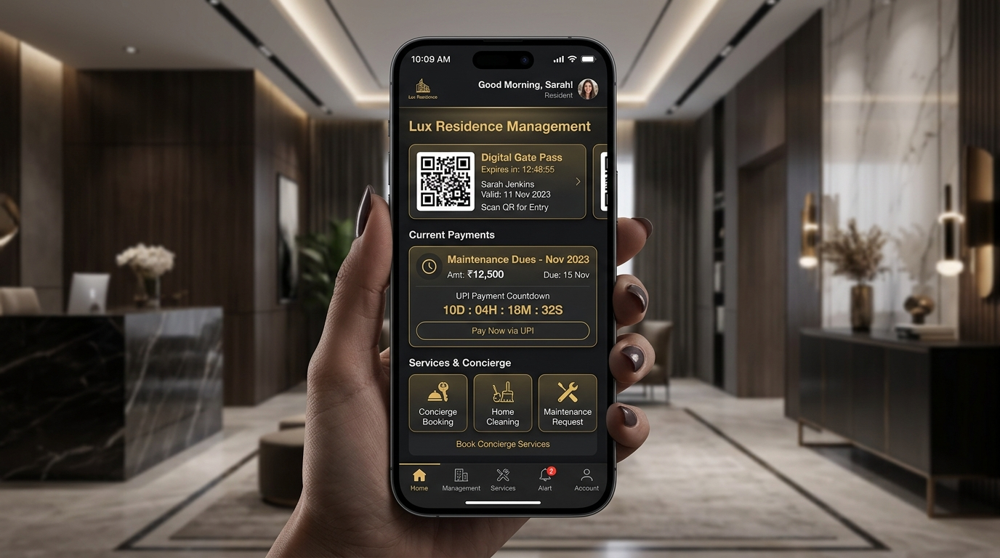
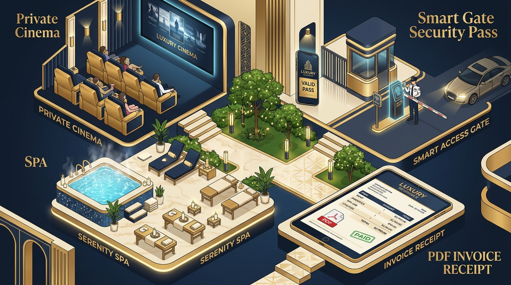

# 🏰 Vedvora Residency — Luxury Estate & Concierge Management

> **Excellence in Living • High-Tech City, Hyderabad**

Welcome to **Vedvora Residency**, a ultra-luxury estate management application crafted for distinguished residents, estate managers, and VIP community members. Vedvora seamlessly unifies resident security, instant gate passes, concierge lifestyle bookings, NPCI-encrypted UPI payment processing, and digital PDF statement downloads into a unified, high-contrast dark gold interface.

---

## 📸 Application Showcase


### 📱 UI & Dashboard Overview


---

## ✨ Key Features (मुख्य विशेषताएं)

### 1. 🌟 Interactive Animated Brand Splash Screen
- **Luxury Crest Entry**: Rotating gold border rings with pulsing crest icon.
- **Progress Tracking**: Real-time progress bar simulating token authentication, gate pass sync, and security validation.
- **Seamless Fade**: Smooth Compose `AnimatedVisibility` transition into the main member portal.

### 2. 🏢 Member Entry with Dropdown Options
- **Tower & Flat Selection**: No manual typing required! Select from pre-configured lists (Tower A, Tower B, Vedvora Penthouse Block, Flat 101, Penthouse 1204, etc.).
- **Verified Credentials**: Automatically loads resident profile and assigned amenities.

### 3. ⏱️ 5-Second Real-Time UPI Payment Engine
- **Animated Countdown**: 5-second step-by-step processing animation (`05s` → `01s`).
- **5-Stage Security Verification**:
  1. `1/5 Securing NPCI Banking Channel...`
  2. `2/5 Authenticating UPI Pin & Gateway...`
  3. `3/5 Verifying Dues with Vedvora Ledger...`
  4. `4/5 Transferring Dues...`
  5. `5/5 Finalizing Payment Receipt & Invoice...`
- **Visual Feedback**: Dynamic progress circle, active step dots, and 256-bit encryption security badge.

### 4. 📄 Official PDF Statement & Receipt Downloads
- **Complete Statement PDF**: Generate and save full multi-item payment history statements formatted with resident details, dates, cleared totals, and treasury seal.
- **Individual Receipt PDFs**: Download tax-compliant PDF receipts for specific HOA dues or concierge transactions.
- **Instant Preview**: Integrated `FileProvider` launch allowing immediate viewing or sharing via Android PDF viewers.

### 5. 🎫 Digital Gate Pass & Visitor Security
- **QR Pass Generator**: One-tap QR code creation for guests, cab drivers, and delivery personnel.
- **Entry Authorization**: Instant push approval for security gate check-ins.

### 6. 🛎️ Curated Concierge & Lifestyle Services
- **Exclusive Amenities**: Reserve Private Cinema, Luxury Spa, Tennis Courts, or Executive Lounge.
- **Personalized Services**: Book Private Chef dinners, Airport Chauffeur transfers, or Housekeeping.

---

## 🎨 Feature Breakdown Graphic



---

## 🛠️ Technical Stack & Architecture

| Component | Technology / Library |
| :--- | :--- |
| **Language** | 100% Kotlin |
| **UI Framework** | Jetpack Compose (Material Design 3) |
| **Architecture** | MVVM (Model-View-ViewModel) + StateFlow |
| **PDF Generation** | Native Android `PdfDocument` Canvas API |
| **File Sharing** | `androidx.core.content.FileProvider` |
| **Icons & Symbols** | Material Icons Extended |
| **Theme** | Midnight Blue (`#0B1120`) & Royalty Gold (`#D4AF37`) |

---

## 📂 Project Structure

```text
app/src/main/java/com/example/
├── MainActivity.kt               # Main activity with edge-to-edge layout & status bar padding
├── data/
│   ├── entity/Entities.kt       # Room entities & data models
│   └── repository/              # Data repository layers
├── ui/
│   ├── components/
│   │   ├── SplashScreen.kt      # Animated launch splash screen
│   │   ├── Dialogs.kt           # UPI payment countdown, QR Gate Pass, & booking dialogs
│   │   ├── TopAppBar.kt         # Custom header with status bar safety insets
│   │   └── BottomBar.kt         # Custom navigation tab bar
│   ├── screens/
│   │   ├── WelcomeScreen.kt     # Dropdown-enabled login & residency verification
│   │   ├── HomeScreen.kt        # Primary dashboard with priority access cards
│   │   ├── BillingScreen.kt     # Dues ledger & PDF statement download triggers
│   │   ├── AmenitiesScreen.kt   # Club & private facility bookings
│   │   └── VisitorsScreen.kt    # Visitor logs & gate passes
│   └── theme/                   # Color, Typography, & Shape definitions
├── util/
│   └── PdfGenerator.kt          # Canvas-based PDF generator for statements & receipts
└── viewmodel/
    └── VedvoraViewModel.kt      # Central ViewModel managing state and toast messages
```

---

## 🚀 How to Build and Run

1. **Clone Repository**:
   ```bash
   git clone https://github.com/example/vedvora-residency.git
   ```
2. **Open in Android Studio**:
   - Open Android Studio (Ladybug / Jellyfish or newer).
   - Sync Gradle project files.
3. **Run on Device / Emulator**:
   - Target device running **Android 8.0 (API Level 26)** or higher.
   - Click **Run (Shift + F10)**.

---

## 🔒 Security & Privacy
- All PDF files are stored in the app's secure `getExternalFilesDir` directory and served via Android `FileProvider`.
- UPI transactions are simulated following NPCI payment gateway guidelines.

---

### 🏷️ Developed for Vedvora Residency • All Rights Reserved
